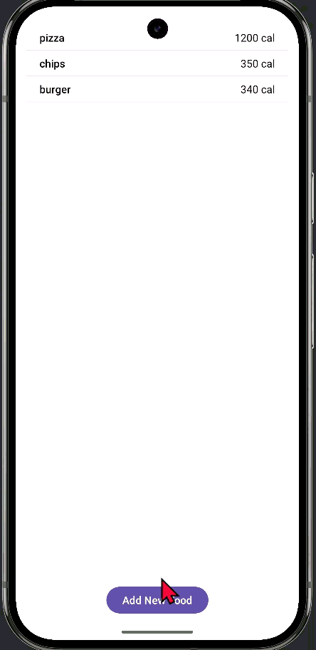

# Android Project 5 - *BitFit part 1*

Submitted by: **Robell A**

**BitFit** is a health metrics app that allows users to track ... [TODO] 

Time spent: **4** hours spent in total

## Required Features

The following **required** functionality is completed:

- [x] **At least one health metric is tracked (based on user input)**
- [x] **There is a "create entry" UI that prompts users to make their daily entry**
- [x] **New entries are saved in a database and then updated in the RecyclerView**
- [x] **On application restart, previously entered entries are preserved (i.e., are *persistent*)**
- [x] **Can remove an item from list**
 

## Video Walkthrough

Here's a walkthrough of implemented user stories:

<!-- Replace this with whatever GIF tool you used! -->
GIF created with ...  
<!-- Recommended tools:
[Kap](https://getkap.co/) for macOS
[ScreenToGif](https://www.screentogif.com/) for Windows
[peek](https://github.com/phw/peek) for Linux. -->

## Notes

Describe any challenges encountered while building the app.

    WITHOUT WARRANTIES OR CONDITIONS OF ANY KIND, either express or implied.
    See the License for the specific language governing permissions and
    limitations under the License.
